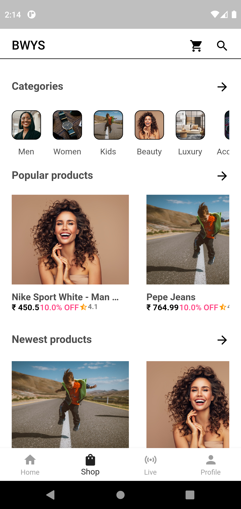
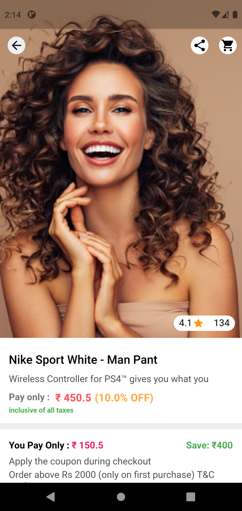
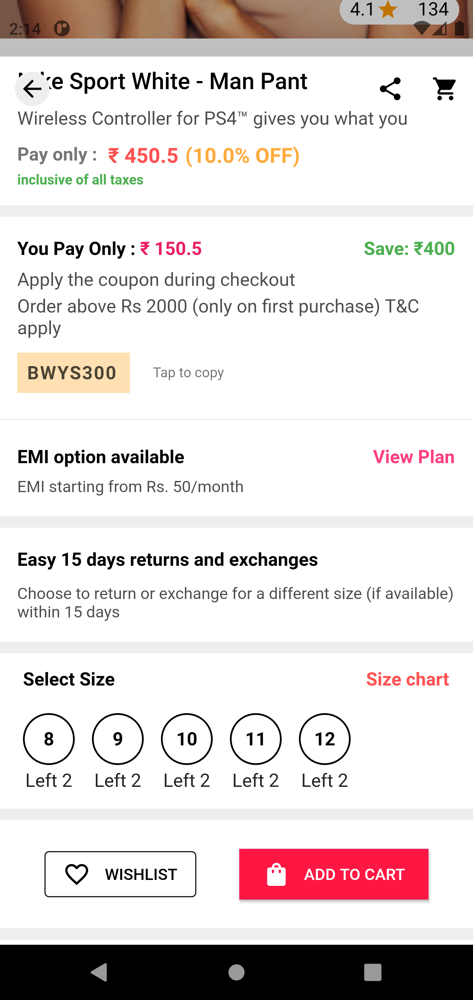
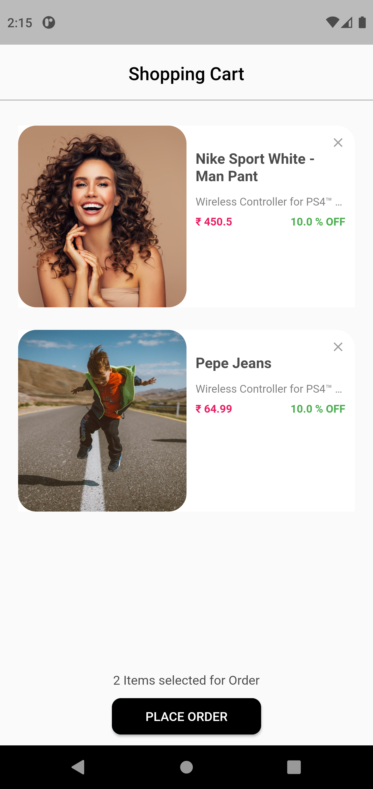

# BWYS

An Ecommerce App made with Flutter with a Tiktok like feature to add the ability for the user to buy the clothes that people are wearing in the video.

<head> 
	<title> 
	</title> 
	 
   </head> 
   

 
    
 
       
    
 
    
 
       
    
 

 

## Getting Started

This project is a starting point for a Flutter application.

A few resources to get you started if this is your first Flutter project:

- [Lab: Write your first Flutter app](https://flutter.dev/docs/get-started/codelab)
- [Cookbook: Useful Flutter samples](https://flutter.dev/docs/cookbook)

For help getting started with Flutter, view our
[online documentation](https://flutter.dev/docs), which offers tutorials,
samples, guidance on mobile development, and a full API reference.
